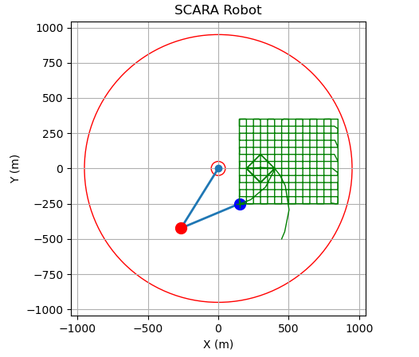

# GRBL development utils

Just some scripts to help while working on the scara kinematics for grblHAL.

`setup.sh` clones a hardware driver and puts the forked core in there

`compile_and_copy.sh` will use cmake to build the driver and grbl code, and uploads the compiled firmware to the rpi2040 storage

`test/scara_grbl_visualizer.py` send a simple gcode program to grbl while plotting the scara robot configuration based on the reported joint angles.

Also usefull info:

- set `$14=73` to invert all input pins. Prevent alarm at startup.
- G90: absolute coorinates, G91: incremental coordinates
- For scara: steps per rad really high, set `$100=20000` and `$101=200000`
